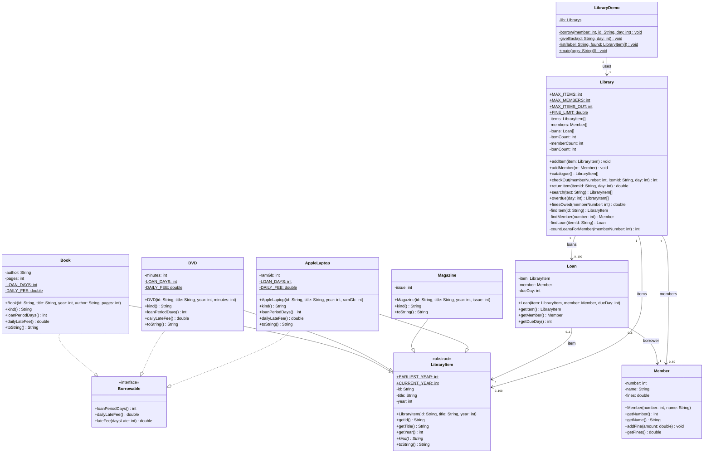

```mermaid
classDiagram
    class Borrowable {
        <<interface>>
        +loanPeriodDays() int
        +dailyLateFee() double
        +lateFee(daysLate: int) double
    }
    class LibraryItem {
        <<abstract>>
        +EARLIEST_YEAR: int$
        +CURRENT_YEAR: int$
        -id: String
        -title: String
        -year: int
        +LibraryItem(id: String, title: String, year: int)
        +getId() String
        +getTitle() String
        +getYear() int
        +kind() String*
        +toString() String
    }
    class Book {
        -author: String
        -pages: int
        -LOAN_DAYS: int$
        -DAILY_FEE: double$
        +Book(id: String, title: String, year: int, author: String, pages: int)
        +kind() String
        +loanPeriodDays() int
        +dailyLateFee() double
        +toString() String
    }
    Book --|> LibraryItem
    Book ..|> Borrowable
    class DVD {
        -minutes: int
        -LOAN_DAYS: int$
        -DAILY_FEE: double$
        +DVD(id: String, title: String, year: int, minutes: int)
        +kind() String
        +loanPeriodDays() int
        +dailyLateFee() double
        +toString() String
    }
    DVD --|> LibraryItem
    DVD ..|> Borrowable
    class Magazine {
        -issue: int
        +Magazine(id: String, title: String, year: int, issue: int)
        +kind() String
        +toString() String
    }
    Magazine --|> LibraryItem
    class AppleLaptop {
        -ramGb: int
        -LOAN_DAYS: int$
        -DAILY_FEE: double$
        +AppleLaptop(id: String, title: String, year: int, ramGb: int)
        +kind() String
        +loanPeriodDays() int
        +dailyLateFee() double
        +toString() String
    }
    AppleLaptop --|> LibraryItem
    AppleLaptop ..|> Borrowable
    class Member {
        -number: int
        -name: String
        -fines: double
        +Member(number: int, name: String)
        +getNumber() int
        +getName() String
        +addFine(amount: double) void
        +getFines() double
    }
    class Loan {
        -item: LibraryItem
        -member: Member
        -dueDay: int
        +Loan(item: LibraryItem, member: Member, dueDay: int)
        +getItem() LibraryItem
        +getMember() Member
        +getDueDay() int
    }
    Loan "0..5" --> "1" Member: borrower
    Loan "0..1" --> "1" LibraryItem: item
    class Library {
        +MAX_ITEMS: int$
        +MAX_MEMBERS: int$
        +MAX_ITEMS_OUT: int$
        +FINE_LIMIT: double$
        -items: LibraryItem[]
        -members: Member[]
        -loans: Loan[]
        -itemCount: int
        -memberCount: int
        -loanCount: int
        +addItem(item: LibraryItem) void
        +addMember(m: Member) void
        +catalogue() LibraryItem[]
        +checkOut(memberNumber: int, itemId: String, day: int) int
        +returnItem(itemId: String, day: int) double
        +search(text: String) LibraryItem[]
        +overdue(day: int) LibraryItem[]
        +finesOwed(memberNumber: int) double
        -findItem(id: String) LibraryItem
        -findMember(number: int) Member
        -findLoan(itemId: String) Loan
        -countLoansForMember(memberNumber: int) int
    }
    Library "1" --> "0..100" LibraryItem: items
    Library "1" --> "0..50" Member: members
    Library "1" --> "0..100" Loan: loans
    class LibraryDemo {
        -lib: Librarys$
        -borrow(member: int, id: String, day: int) void$
        -giveBack(id: String, day: int) void$
        -list(label: String, found: LibraryItem[]) void$
        +main(args: String[]) void$
    }
    LibraryDemo "1" --> "1" Library: uses
```
